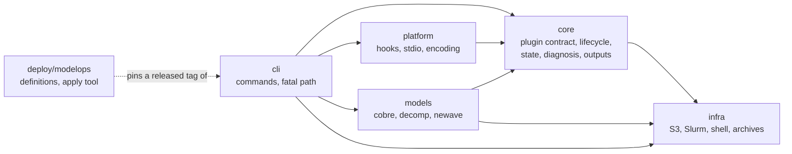
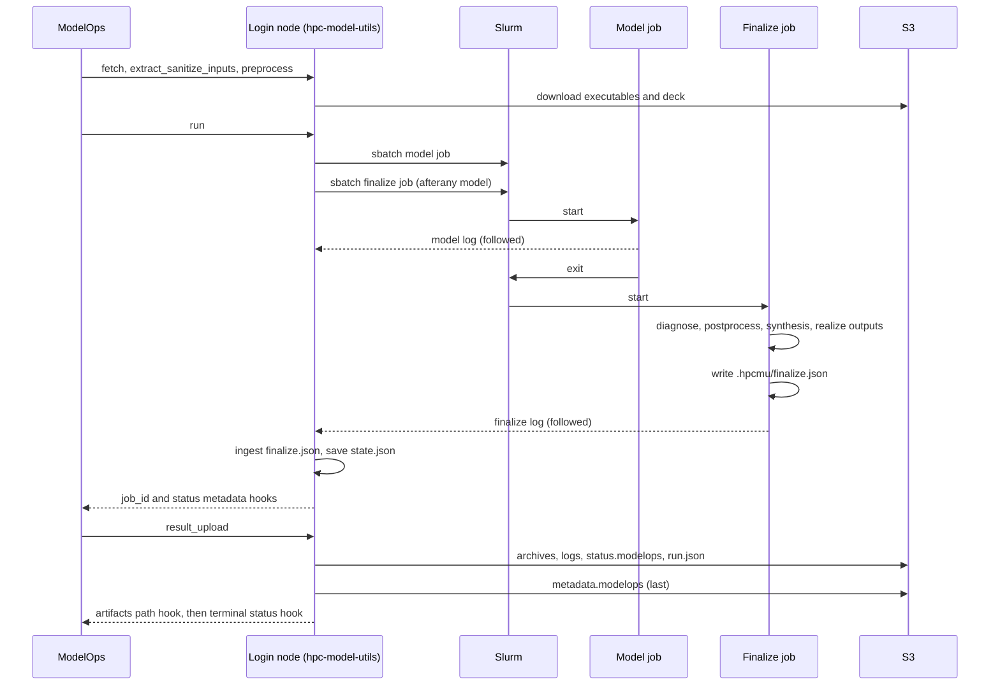

# hpc-model-utils architecture

This document explains how the v2 engine is built, for maintainers and for
coding assistants that change it. It describes the shipped code; each section
cites the file and symbol it describes. For the user-facing view, read the
[README](../README.md). For the status vocabulary that ModelOps consumers
see, read [the status semantics notice](notices/v2-status-semantics.md).

## Overview

hpc-model-utils is a command line tool that runs a scientific model (NEWAVE,
DECOMP or cobre) on a Slurm cluster on behalf of ModelOps, a workflow
platform. ModelOps starts one login-side command per workflow task. The
commands fetch inputs from S3, prepare the deck, submit a model job and a
finalize job, follow their logs, diagnose the outcome, and publish the
artifacts back to S3. The tool reports progress to ModelOps by writing hook
lines on standard output. The code is split into five layers plus the
`deploy/modelops` operator tooling that applies the ModelOps definitions.

Arrows point from the importing layer to the imported one. `deploy/modelops`
is outside the package: it holds JSON definitions and shell scripts that call
the installed console script, so it depends on a released version of the
tool, never on its modules.

## Layers and import direction

The package `src/hpc_model_utils/` has five layers with a fixed import
direction (ADR-002):

| Layer | Directory | May import |
| --- | --- | --- |
| `infra` | `src/hpc_model_utils/infra/` | nothing in the package |
| `core` | `src/hpc_model_utils/core/` | `infra` |
| `platform` | `src/hpc_model_utils/platform/` | `core` |
| `models` | `src/hpc_model_utils/models/` | `core`, `infra` |
| `cli` | `src/hpc_model_utils/cli/` | all of the above |

`core` never imports `models`: it receives a plugin instance as an argument,
and the registry lives in `src/hpc_model_utils/models/__init__.py::PLUGINS`.
That is what keeps the engine model-agnostic.

Two more rules are enforced by the same test,
`tests/unit/test_import_direction.py::ALLOWED_EDGES` (the table above) and
its companions in that file:

- The literal `${CurrentExecution` may appear only in
  `src/hpc_model_utils/platform/modelops.py`. No other module writes a hook.
- The `inewave` and `idecomp` libraries may be imported only where the test's
  `RESTRICTED_IMPORTS` allows it, which is inside `models`.

A change that breaks the direction fails `tests/unit/test_import_direction.py`
before it reaches review.

## The plugin contract

A model is one subclass of `src/hpc_model_utils/core/plugin.py::ModelPlugin`
(ADR-003). Core code never branches on a model name; it calls the contract.

Class attributes describe the model:

| Attribute | Meaning |
| --- | --- |
| `name` | Lowercase identifier, validated against `[a-z][a-z0-9_]*` |
| `executables` | An `ExecutableSpec` naming the entrypoint, in `src/hpc_model_utils/core/plugin.py::ExecutableSpec` |
| `sanitize_encoding`, `sanitize_exclude` | Whether and what to re-encode as UTF-8 after extraction |
| `output_patterns` | Regexes for the files the model writes |
| `log_patterns` | Layer-2 diagnosis patterns over the model log |
| `parent_model`, `parent_artifacts`, `always_write_parent_path` | Chained-run (parent) behavior |

Six methods are abstract, so a plugin that omits one cannot be instantiated:

| Method | Responsibility |
| --- | --- |
| `study_info` | Study metadata read from the deck |
| `launch` | A `LaunchSpec` (launcher, command line, node shape) from `Resources` |
| `primary_evidence` | The files whose absence means the model produced nothing |
| `diagnose` | The layer-3 `Verdict` from the workspace and the job report |
| `input_files` | The deck files, unique, deterministic and non-empty |
| `outputs` | An `OutputPlan` declaring the archives and raw files to publish |

Six methods have defaults and are overridden only when needed: `fetch_parent`,
`prepare`, `postprocess`, `synthesis_args`, `check_executables` and
`ingest_offline`. A plugin that supports offline ingestion overrides
`ingest_offline`; no capability flag exists.

`ModelPlugin.__init_subclass__` validates `name` and `executables` when the
class is created, so a bad plugin fails at import time. A recordable
postprocess failure is signalled with
`src/hpc_model_utils/core/plugin.py::PostprocessError`.

Plugins are stateless instances registered in an explicit mapping, with no
entry points and no module scanning:
`src/hpc_model_utils/models/__init__.py::PLUGINS`, looked up by
`src/hpc_model_utils/models/__init__.py::get_plugin`. The cross-plugin
invariants are checked once, for every registered plugin, in
`tests/contract/test_plugin_conformance.py::CONFORMANCE_WORKSPACES`. No test
in that file branches on a plugin name.

## The platform protocol

ModelOps reads the standard output of each login-side command and acts on
`${CurrentExecution.*}` hook lines and on a few trigger phrases. The
`platform` layer makes sure only the tool's own hooks reach that stream
(ADR-006, ADR-007):

- `src/hpc_model_utils/platform/stdio.py::install` saves the original fd 2 as
  the fatal channel, redirects fd 2 onto fd 1, and wraps `sys.stdout` and
  `sys.stderr` in
  `src/hpc_model_utils/platform/stdio.py::NeutralizingStream`. Every line
  written through them passes `neutralize` first.
- `src/hpc_model_utils/platform/encoding.py::neutralize` strips control
  characters, rewrites `${` to `$ {`, and defangs the phrases in
  `src/hpc_model_utils/platform/encoding.py::TRIGGER_PATTERNS`
  (`Created temporary dir`, `Submitted batch job`, `HPCMU_TOOL `).
- `src/hpc_model_utils/platform/encoding.py::PLATFORM_IDENTIFIERS` lists the
  workflow and task parameter names (for example `inputFile` and
  `maxCoresPerNode`). The hook encoder breaks each one with a word joiner so
  a relayed value cannot be re-expanded by the platform.
- `src/hpc_model_utils/platform/modelops.py::Reporter` is the only hook
  writer. It emits each metadata key and the artifacts path at most once and
  the terminal status exactly once. The mapping from run status to hook method
  is `src/hpc_model_utils/platform/modelops.py::STATUS_HOOKS`:

| `RunStatus` | Hook |
| --- | --- |
| `SUCCESS` | `SetSuccess` |
| `INFEASIBLE` | `SetModelError` |
| `DATA_ERROR` | `SetDataError` |
| `RUNTIME_ERROR`, `TIMEOUT`, `INFRA_ERROR`, `LICENSE_ERROR`, `CANCELLED`, `UNKNOWN` | `SetRuntimeError` |

- Job scripts export `HPCMU_PLATFORM=off` in their prelude
  (`src/hpc_model_utils/core/launch.py::render_prelude`), and
  `Reporter.from_env` then disables itself. Only login-side processes emit
  hooks; the model and finalize jobs never do.

The neutralizing guarantee is per line. A C-level write to fd 2 or a child
process that inherits fd 2 bypasses it, which is why child output is relayed
through the follower rather than inherited (see
[Logs and the relay](#logs-and-the-relay)).

## State ownership

Two JSON files under `.hpcmu/` hold run state, and each has exactly one
writer (ADR-010):

| File | Owner | Written by |
| --- | --- | --- |
| `.hpcmu/state.json` | The login side | `src/hpc_model_utils/core/state.py::StateStore` |
| `.hpcmu/finalize.json` | The finalize job | `src/hpc_model_utils/core/state.py::write_finalize` |

The login side reads the job-owned file with
`src/hpc_model_utils/core/state.py::load_finalize` and merges it into its own
state. The finalize job reads `state.json` but never writes it, and the login
side never writes `finalize.json`. Because of that split, no lock is needed between the
two sides.

Both files are written with
`src/hpc_model_utils/core/state.py::write_atomic`: a temporary file in the
same directory, `fsync`, then `os.replace`, then a best-effort directory
`fsync`. Both carry a `kind` and a `schema_version`, and both readers reject
unknown keys; the `finalize.json` reader also rejects a mismatched `run_id`,
so a stale or foreign file fails loudly instead of being half-read. A requeued finalize job replaces
`finalize.json` atomically; the reader sees either the old or the new record,
never a mix.

`src/hpc_model_utils/core/state.py::RunState` is the typed login-side record.
`src/hpc_model_utils/core/state.py::FinalizeRecord` is the job-side one: the
diagnosis, the postprocess and synthesis outcomes, the realized outputs and
the finalize step record.

## Diagnosis

Every run ends with one `Diagnosis`: a status, a `rule_id`, a reason, up to
20 evidence items, and the job id (ADR-014).
`src/hpc_model_utils/core/diagnosis.py::evaluate` composes it from layers,
and the first layer that has a verdict wins:

1. **L1, Slurm accounting.** `src/hpc_model_utils/core/diagnosis.py::SLURM_RULES`
   maps `sacct` states (timeout, out of memory, node failure, preemption,
   cancellation) to statuses with `slurm.*` rule ids.
2. **L2, log patterns.** The plugin's `log_patterns` are matched against the
   model log. The first match is the candidate verdict.
3. **The guard.** If any file in the plugin's `primary_evidence` is missing,
   the verdict is `RUNTIME_ERROR` with the rule id `core.missing_output`.
4. **L3, plugin rules.** Only when no earlier layer decided, the plugin's
   `diagnose` runs. An exception inside it is caught and becomes `UNKNOWN`
   with `core.diagnosis_exception`, so a plugin bug never hides the outcome.

Rule ids are `<scope>.<name>` with the scope one of `slurm`, `core`, `newave`,
`decomp` or `cobre`. The published annotation is
`<STATUS>: <reason> [<rule_id>]`, capped at 500 characters by
`src/hpc_model_utils/core/diagnosis.py::ANNOTATION_MAX_LENGTH`. The status
tokens are `src/hpc_model_utils/core/diagnosis.py::RunStatus`.

The finalize job runs the evaluation on the cluster, next to the logs
(`src/hpc_model_utils/core/lifecycle/finalize.py::diagnose_workspace`), so
the login side only has to ingest the result. If the finalize job dies
without writing its record, the login side diagnoses the finalize job itself
from `sacct` and records `core.finalize_crashed`.

## The run lifecycle

Each ModelOps task maps to one CLI command in
`src/hpc_model_utils/cli/workflow.py`, which calls a plugin-agnostic step in
`src/hpc_model_utils/core/lifecycle/`:

| Stage | Command | Step |
| --- | --- | --- |
| Fetch executables | `check_and_fetch_executables` | `src/hpc_model_utils/core/lifecycle/fetch.py::fetch_executables` downloads by prefix, then calls the plugin's `check_executables` |
| Fetch inputs | `check_and_fetch_inputs` | `src/hpc_model_utils/core/lifecycle/fetch.py::fetch_inputs` downloads the deck by exact key and validates the parent run |
| Extract and sanitize | `extract_sanitize_inputs` | `src/hpc_model_utils/core/lifecycle/prepare.py::extract_sanitize_inputs` extracts the deck, purges stale outputs and re-encodes text |
| Preprocess | `preprocess` | `src/hpc_model_utils/core/lifecycle/prepare.py::preprocess` extracts the parent archive and calls the plugin's `prepare` |
| Run | `run` | `src/hpc_model_utils/core/lifecycle/run.py::run` submits, follows and ingests |
| Publish | `result_upload` | `src/hpc_model_utils/core/lifecycle/publish.py::publish` uploads and emits the terminal status |
| Cancel | `cancel_run` | `src/hpc_model_utils/core/lifecycle/cancel.py::cancel` cancels the recorded jobs |
| Offline ingest | `ingest_offline_run` | `src/hpc_model_utils/core/lifecycle/ingest.py::ingest_offline_run` imports a run executed elsewhere |

`run` is the stage with the most moving parts (ADR-020). It writes the job
scripts with `src/hpc_model_utils/core/launch.py::render_model_script` and
`src/hpc_model_utils/core/launch.py::render_finalize_script`, then submits
the model job and the finalize job with `--dependency=afterany:<model>`, in
that order. Each submission and its ledger entry run with `SIGTERM` and
`SIGHUP` blocked, so a signal can never lose a job id. The command then
follows the model log, follows the finalize log, ingests `finalize.json`,
saves state once and re-emits the status and job id as hooks last. A
`SIGTERM`, `SIGHUP` or broken stdout pipe during this window cancels the
recorded jobs
(`src/hpc_model_utils/core/lifecycle/signals.py::cancel_on_termination`).

The job-side step is
`src/hpc_model_utils/core/lifecycle/finalize.py::finalize`. It diagnoses the
model job; runs postprocess and the synthesis step (sintetizador for NEWAVE
and DECOMP, `cobre-bridge dashboard` for cobre) only on `SUCCESS`; always
realizes the output plan; and writes `finalize.json` once. A synthesis tool
that exits non-zero or a postprocess that raises keeps `SUCCESS` but records
the failure in the reason and the evidence. A missing synthesis tool becomes
`RUNTIME_ERROR` with `core.synthesis_missing`.

Realizing outputs is
`src/hpc_model_utils/core/outputs.py::realize`, a module function that
applies the plugin's declarative
`src/hpc_model_utils/core/outputs.py::OutputPlan` to the workspace. Archives
are written one at a time and the members of each archive are compressed in
parallel (ADR-040). `.hpcmu/` and `assets/` are never matched, and symlinks
are never archived.

Publish order is a data-integrity contract (ADR-042).
`src/hpc_model_utils/core/lifecycle/publish.py::publish` uploads every
artifact first, then `saidas/status.modelops`, then `saidas/run.json`, and
`saidas/metadata.modelops` last, because a successful `metadata.modelops` is
the marker consumers trust. When the prefix already holds a previous run, a
`RUNTIME_ERROR` metadata and status pair is written before the first new
artifact, so a kill in the middle cannot leave an old success next to new
files. On a successful publish, the artifacts-path hook and the terminal status
hook are emitted once, after every upload has finished. Nothing already in the
prefix is deleted.

## Logs and the relay

Each Slurm job writes `.hpcmu/logs/<phase>-<jobid>.out`, where the phase is
`model` or `finalize`
(`src/hpc_model_utils/core/workspace.py::Workspace`). The login side tails
those files while the jobs run
(`src/hpc_model_utils/core/follow.py::follow`, which drives one
`src/hpc_model_utils/core/follow.py::LogTail` per log) and relays each line
to ModelOps (ADR-046):

- A line is written verbatim, exactly once, with the timestamp the job gave
  it. The relay adds no prefix, and `LOGLEVEL` does not filter it
  (`src/hpc_model_utils/cli/root.py::configure_logging`). Only the
  neutralizer touches it, to keep hooks safe.
- `LogTail` holds the file descriptor and detects truncation and rotation.
  It emits one `[hpcmu]` marker line for each such event instead of losing
  or repeating output.
- Because a Slurm log on a shared filesystem can be invisible to the login
  node for a short time, `follow` keeps polling a log that has never opened
  for a grace period (`missing_log_grace`), and closes with a final drain
  that reopens the path by name. If the log never appears, it emits a
  `log never appeared` marker.
- The tool's own diagnostics go through a separate, formatted logger. An
  expected failure (a `HpcmuError` or a usage error) is logged as one line,
  `<command> failed: <category>: <message>`, without a traceback; an
  unexpected exception keeps its traceback
  (`src/hpc_model_utils/cli/root.py::main` and its fatal path).

Synthesis output is not relayed in full. The finalize job writes its
complete merged output to `.hpcmu/logs/synthesis.out`, relays only the lines
at WARNING level or above, and `publish` uploads the file as
`saidas/logs/synthesis.out`. If the file cannot be written, every line is
relayed instead.

To prove that a run lost or duplicated no line, run
`deploy/modelops/check_relay.py` on the exported relayed output and the job
logs. It is the completeness check for the relay; test fast-failing runs with
it as well as long ones.

## Workflows as code

The ModelOps Task and Workflow definitions live in this repository as JSON
plus one script file per Task, and an operator tool applies them. Definitions
are versioned with the code, every environment-specific value is a
placeholder, and a definition that needs a new `src/` behavior must be applied
only after the release that contains it. The layout, the placeholder grammar
and the apply procedure are in
[deploy/modelops/README.md](../deploy/modelops/README.md).

## Adding a model

cobre is the worked example. It was added without any change to `core/`, and
the numbered checklist below follows the order it was built in. The later
cobre dashboard needed one contract change: `synthesis_args` takes the
workspace (`synthesis_args(ws, cpus)`), so a plugin can name its case
directory. Replace `cobre` with the new model's name. All paths are relative
to the repository root.

1. **Add a platform identifier first, if the model needs a new workflow
   parameter.** cobre needed `--max-cores-per-node`, so `maxCoresPerNode`
   was added to
   `src/hpc_model_utils/platform/encoding.py::PLATFORM_IDENTIFIERS`. A new
   parameter name is a `src/` change, so it must be released before any
   ModelOps definition uses it (step 8).
2. **Write the skeleton.** Create `src/hpc_model_utils/models/cobre/` with a
   thin `plugin.py` and one module per concern.
   `src/hpc_model_utils/models/cobre/plugin.py::CobrePlugin` sets
   `name`, `executables = ExecutableSpec("cobre-mpi")` and
   `sanitize_encoding = False`, and delegates every method to a sibling
   module. The deck readers in
   `src/hpc_model_utils/models/cobre/case.py` work from the zip member list,
   so a flat deck and a deck under one top folder are read the same way, and
   every missing or malformed file is a `DataError` naming a zip-relative path.
   `CobrePlugin.check_executables` is a static check at fetch time: the file
   is a regular, executable ELF binary. It never runs the binary.
3. **Write the launch.**
   `src/hpc_model_utils/models/cobre/launch.py::launch_spec` is a pure
   derivation from `Resources`. cobre runs `cobre-mpi` only, and
   `--max-cores-per-node` is required: threads per node `T` is that value,
   nodes `K` is cores divided by `T`, and cores must be a multiple of `T`.
   Every node count uses the same single `SRUN_PMIX` launch,
   `cobre-mpi run <case> --threads T --comm-backend mpi`, with one rank per
   node. `--comm-backend mpi` makes a build without MPI exit instead of
   silently running locally.
4. **Write the diagnosis, including the in-job self-check.** Model facts that
   cannot be known before the run are verified in the job and mapped to a
   status.
   `src/hpc_model_utils/models/cobre/diagnosis.py::RULES` is an ordered table
   of `Rule` rows over a frozen
   `src/hpc_model_utils/models/cobre/diagnosis.py::CobreEvidence`, and the
   first applicable row wins. The cobre-mpi `Backend:` and `Solver:` lines
   and the `HPCMU_SHAPE nodes=` line from the job prelude are the self-check:
   a run that exits without reporting an MPI backend is `RUNTIME_ERROR` with
   `cobre.mpi_not_started`. cobre never returns `INFEASIBLE`; an
   infeasible linear program is a cobre exit code that maps to another
   status. An incomplete simulation is `RUNTIME_ERROR`. Output metadata is read
   only after a clean exit, and `primary_evidence` is the exit file alone.
   `LOG_PATTERNS` is empty because every cobre condition needs the exit code
   or a fact absent from any single line.
5. **Declare the outputs.**
   `src/hpc_model_utils/models/cobre/outputs.py::output_plan` returns an
   `OutputPlan` with one archive per phase (`training`, `policy`,
   `simulation`) and the raw phase metadata files. The archives use a `Tree`
   layout, because the Hive-style output shares basenames such as
   `part-0000.parquet`, which a `Flat` layout rejects. A phase that did not
   run has no directory, so it produces no archive.
6. **Add the system scenarios.** Build a synthetic case in code (cobre uses
   `tests/support/cobre_case.py`, so no model data is vendored) and drive the
   full lifecycle under the fake Slurm in
   `tests/system/test_cobre_scenarios.py`. The scenarios plant a stub as
   `cobre-mpi` and cover the one-node and multi-node launch, the rank-count
   mismatch, the missing-flag data error, the exit-code-to-status table, an
   incomplete simulation and the backend self-check.
7. **Register the plugin and update the registry-pinned tests.** Add the
   plugin to `src/hpc_model_utils/models/__init__.py::PLUGINS`; no other
   `core/` or `cli/` file changes. Three tests pin the registry and must be
   updated in the same change:
   - `tests/unit/cli/test_workflow.py` checks the sorted model list in the
     command metavar and the unknown-model error message.
   - `tests/unit/models/decomp/test_decomp_plugin.py` checks the sorted
     registry keys in `test_sorted_plugins_returns_cobre_decomp_and_newave`;
     rename it when the set changes.
   - `tests/contract/test_plugin_conformance.py` needs a workspace builder
     for the new plugin in `CONFORMANCE_WORKSPACES`, which then runs every
     cross-plugin invariant against it.
8. **Release before any definition pins the change (ADR-054).** The ModelOps
   definitions pin a released tag of this tool. Release the version that
   contains the plugin and any new platform identifier first, add the
   workflow definition under `deploy/modelops/workflows/`, and only then
   apply it. See
   [deploy/modelops/README.md](../deploy/modelops/README.md) and
   [the cobre rollout runbook](runbooks/cobre-rollout.md).

### cobre runtime facts

- The only cobre binary is `cobre-mpi`, and it runs on every node count.
- `--max-cores-per-node` is required for cobre; a launch without it is a
  `DataError`.
- The diagnosis never returns `INFEASIBLE`.
- The summary labels the diagnosis reads (`Backend:`, `Solver:` and the
  stopping-rule names in `TERMINATION_REASONS`) are pinned to cobre v0.14.0
  through v0.17.0. Re-verify them against cobre's own source on every cobre
  upgrade, and update
  `src/hpc_model_utils/models/cobre/diagnosis.py::TERMINATION_REASONS` and
  the matching patterns if they changed.
- The dashboard comes from cobre-bridge `v0.17.0`, pinned in the cobre
  workflow as `synthesisAppVersion`/`synthesisAppSha` and installed by
  `ensure-utils`; it runs only when `output/simulation/` exists
  (`src/hpc_model_utils/models/cobre/outputs.py::dashboard_args`);
  cobre-bridge requires `cobre-python` below 0.18, so re-pin it with every
  cobre upgrade.
